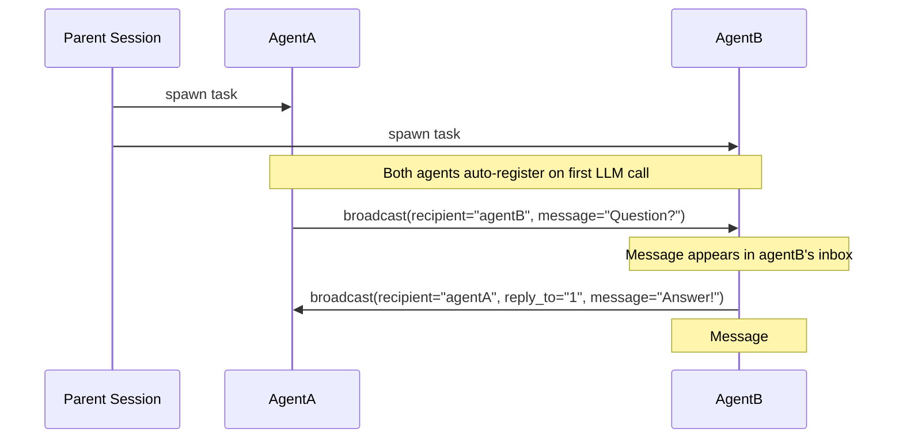

# IAM (Inter-Agent Messaging)

Enable parallel agents to communicate with each other in OpenCode.

## How It Works

When you spawn multiple agents with the Task tool, they can send messages to each other using `broadcast`. Messages appear in each agent's context automatically.



## The `broadcast` Tool

```
broadcast(message="...")                              # Send to all agents
broadcast(recipient="agentB", message="...")          # Send to specific agent
broadcast(reply_to="1,2", message="...")              # Mark messages as handled
broadcast(recipient="agentA", reply_to="1", message="...") # Reply and mark handled
```

### Parameters

| Parameter   | Required | Description                                               |
| ----------- | -------- | --------------------------------------------------------- |
| `message`   | Yes      | Your message content                                      |
| `recipient` | No       | Target agent(s), comma-separated. Omit to send to all     |
| `reply_to`  | No       | Message IDs to mark as handled (e.g., `"1"` or `"1,2,3"`) |

## Receiving Messages

Messages appear in an agent's context as a bundled inbox:

```
📨 INCOMING MESSAGES (2) 📨

--- Message #1 from agentA ---
What's the status on the API?

--- Message #2 from agentA ---
Also, can you check the tests?

---
To respond: broadcast(recipient="agentA", reply_to="1,2", message="...")
```

Messages persist in the inbox until the agent marks them as handled using `reply_to`.

## Installation

Add to your OpenCode config:

```yaml
plugins:
  - name: iam
    module: "@spoons-and-mirrors/iam"
```

The plugin automatically makes `broadcast` available to all task agents.

## Example Workflow

```
# Parent spawns two agents to work on different parts of a feature

AgentA (working on frontend):
  → broadcast(message="Starting frontend work")
  → ... does work ...
  → broadcast(recipient="agentB", message="Need the API schema")

AgentB (working on backend):
  → broadcast(message="Starting backend work")
  → ... sees AgentA's question in inbox ...
  → broadcast(recipient="agentA", reply_to="1", message="Here's the schema: {...}")

AgentA:
  → ... sees AgentB's response in inbox ...
  → broadcast(reply_to="1", message="Got it, thanks!")
```

## Notes

- Agents are assigned aliases automatically: `agentA`, `agentB`, `agentC`, etc.
- Logs are written to `.logs/iam.log` for debugging
