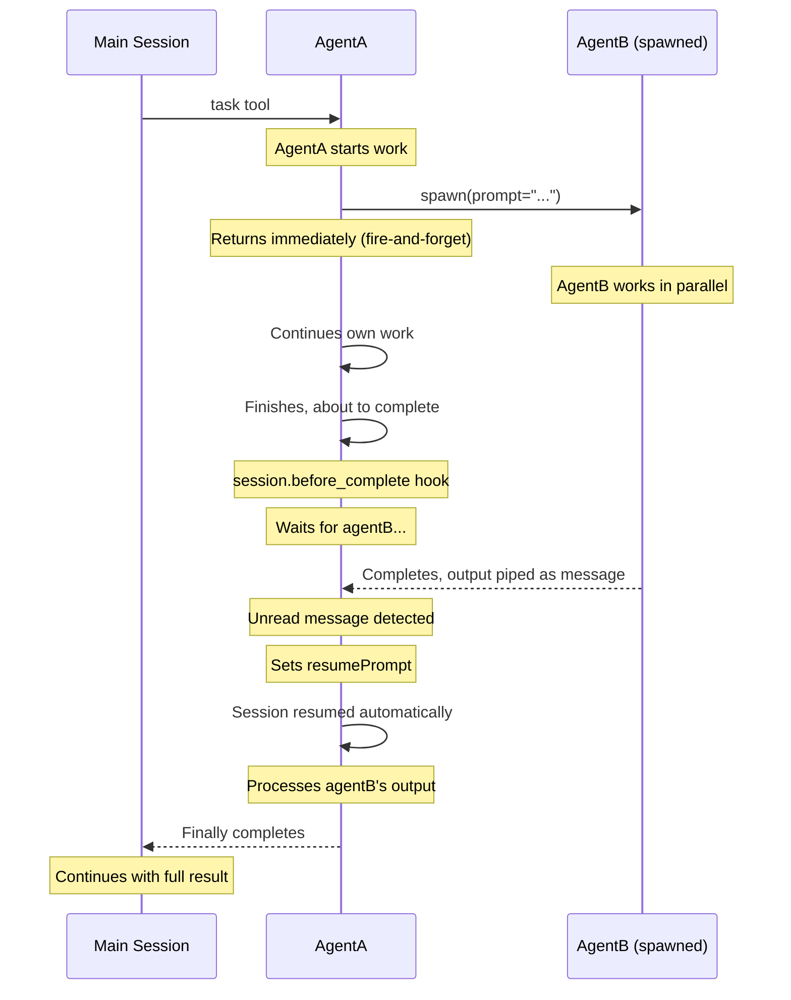
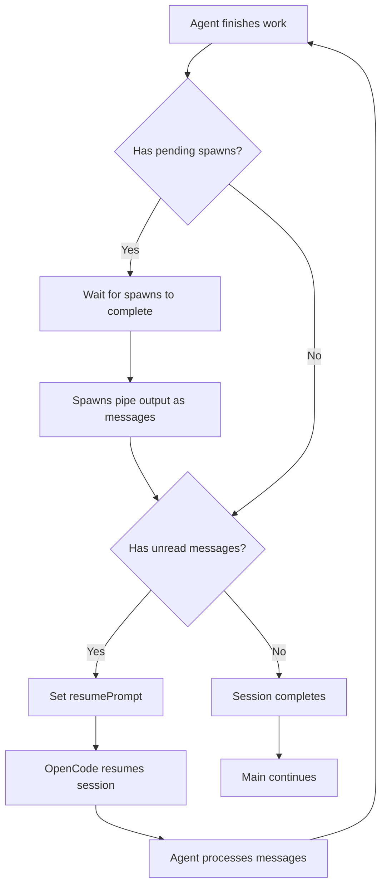
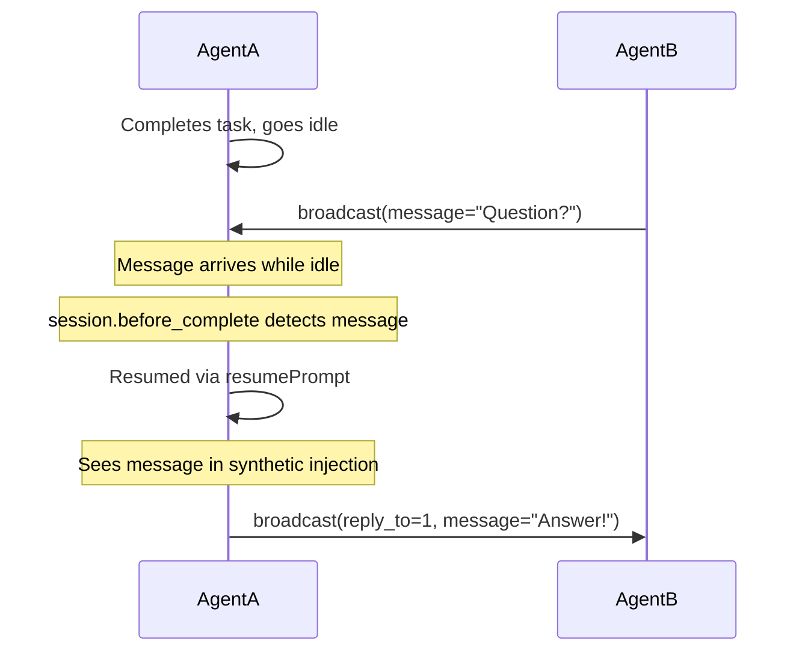

# An Agentic Pocket Universe


## Overview

IAM enables parallel agents to communicate, spawn sibling agents, and coordinate work. The main session automatically waits for all spawned work to complete.



## Installation

```
"plugin": ["@spoons-and-mirrors/iam@latest"]
```

## Tools

### `broadcast` - Inter-agent messaging

```
broadcast(message="...")                     # Send to all agents
broadcast(send_to="agentB", message="...")   # Send to specific agent
broadcast(reply_to=1, message="...")         # Reply to message #1
```

| Parameter  | Required | Description                                   |
| ---------- | -------- | --------------------------------------------- |
| `message`  | Yes      | Your message content                          |
| `send_to`  | No       | Target agent alias                            |
| `reply_to` | No       | Message ID to reply to (auto-wires recipient) |

### `spawn` - Create sibling agents

```
spawn(prompt="Build the login form", description="Login UI")
```

| Parameter     | Required | Description                   |
| ------------- | -------- | ----------------------------- |
| `prompt`      | Yes      | Task for the new agent        |
| `description` | No       | Short description (3-5 words) |

**Key behavior:**

- **Fire-and-forget**: `spawn()` returns immediately, caller continues working
- **Output piping**: When spawned agent completes, its output is sent to caller as a message
- **Main blocks**: The main session waits for ALL spawns and resumed sessions to complete

## Session Lifecycle & Main Blocking

The `session.before_complete` hook ensures main never continues until all work is done:



**How it works:**

1. When an agent is about to complete, `session.before_complete` fires
2. The hook waits for any pending spawns to become idle
3. Spawned agents pipe their output to the caller as messages
4. If unread messages exist, `resumePrompt` triggers a new prompt cycle
5. The agent processes messages and the hook fires again
6. Only when no spawns AND no messages remain does the session complete
7. Main session continues with the full result

## Session Resumption

Idle agents are automatically resumed when they receive messages:



## Receiving Messages

Messages appear as synthetic `broadcast` tool results injected into context:

```json
{
  "tool": "broadcast",
  "state": {
    "input": { "synthetic": true },
    "output": {
      "hint": "ACTION REQUIRED: Announce yourself...",
      "agents": [{ "name": "agentA", "status": "Working on frontend" }],
      "messages": [{ "id": 1, "from": "agentA", "content": "Need help?" }]
    }
  }
}
```

- **`synthetic: true`**: Indicates IAM injection, not a real agent call
- **`hint`**: Shown until agent announces via first broadcast
- **`agents`**: Other agents and their status (always visible, even when idle)
- **`messages`**: Inbox messages, reply using `reply_to`

## Attention Mechanism

On every LLM call, IAM injects a synthetic broadcast result showing:

- All sibling agents (even idle ones) with their status
- Any pending messages in the inbox

This ensures agents always know about each other and never miss messages.

## OpenCode Hook: `session.before_complete`

IAM uses this hook (requires OpenCode PR) to coordinate completion:

```typescript
"session.before_complete"?: (
  input: { sessionID: string; parentSessionID?: string },
  output: { waitForSessions: string[]; resumePrompt?: string },
) => Promise<void>
```

**Output options:**

- `waitForSessions`: Session IDs to wait for (current session auto-filtered)
- `resumePrompt`: If set, starts a new prompt cycle and waits for it

This enables the "main blocks until everything completes" behavior.

## Example: Parallel Work with Spawn

```
Main Session:
  -> task(prompt="Build feature X")

AgentA:
  -> broadcast(message="Building feature X")
  -> spawn(prompt="Create the API", description="API work")
     # Returns immediately, agentA continues
  -> ... does frontend work ...
  -> Finishes own work

  # session.before_complete fires:
  # - Waits for spawned agentB
  # - agentB completes, output piped to agentA
  # - agentA resumed to process output

  -> Sees agentB's output in inbox
  -> broadcast(message="Got the API, integrating...")
  -> Completes with full result

Main Session:
  -> Receives complete result (frontend + API integrated)
```

## Architecture Summary

| Component                 | Purpose                                  |
| ------------------------- | ---------------------------------------- |
| `broadcast`               | Send/receive messages between agents     |
| `spawn`                   | Create sibling agents (fire-and-forget)  |
| Synthetic injection       | Show agents + messages on every LLM call |
| `session.before_complete` | Wait for spawns, trigger resumes         |
| Output piping             | Spawned agent output → caller inbox      |
| Session resumption        | Wake idle agents on new messages         |
